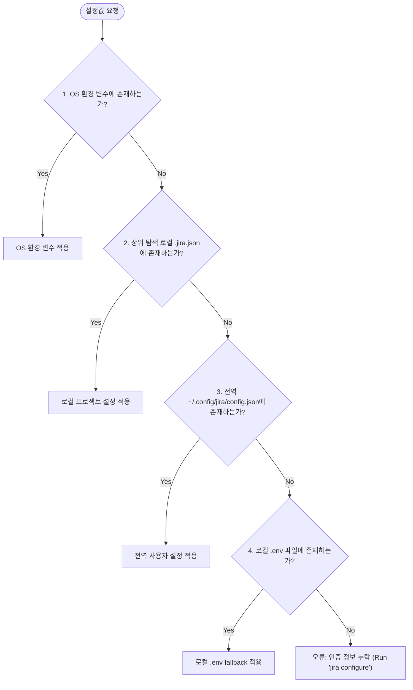

# ⚙️ 02. 설정 및 인증 아키텍처 (Configuration & Authentication)

이 문서는 Jira CLI의 계층적 설정 로딩 메커니즘, 인증 토큰 보안 관리, 대화형 설정 마법사의 동작 방식을 다룹니다.

---

## 🎯 1. 설정 우선순위 (Hierarchical Priority)

Jira CLI는 다양한 환경(로컬 개발, 모노레포, 멀티 프로젝트, CI/CD, 전역 CLI)에서 자연스럽게 동작할 수 있도록 **4단계 우선순위**로 접속 정보를 탐색합니다.



### 상세 우선순위 목록

1. **OS 환경 변수 (최우선)**
   - `JIRA_INSTANCE_URL`: Jira Cloud 인스턴스 도메인 (예: `https://your-domain.atlassian.net`)
   - `JIRA_EMAIL`: Atlassian 계정 이메일 (예: `developer@example.com`)
   - `JIRA_API_TOKEN`: Atlassian 계정 API 토큰
   - `JIRA_PROJECT_KEY`: 기본 대상 프로젝트 키 (지정하지 않을 경우 기본값: `KAN`)
2. **로컬 프로젝트 설정 파일 (상위 디렉토리 순회 탐색)**
   - 현재 작업 디렉토리(`cwd`)부터 루트 디렉토리(`/`)까지 상위로 올라가며 다음 파일들을 순서대로 탐색합니다:
     - `.jira.json`
     - `.jira/config.json`
     - `.agents/jira.json`
3. **글로벌 사용자 설정 파일 (머신 전역)**
   - `~/.config/jira/config.json`
   - `~/.jira/config.json`
4. **로컬 `.env` 파일 (Fallback)**
   - 현재 디렉토리부터 상위로 올라가며 `.env` 파일 내 `JIRA_*` 키-값 쌍을 읽어옵니다.

---

## 📄 2. 설정 파일 스키마 (`.jira.json` / `config.json`)

설정 파일은 표준 JSON 포맷입니다:

```json
{
  "instance_url": "https://joincdream.atlassian.net",
  "email": "developer@example.com",
  "api_token": "ATATT3xFfGF0...YOUR_API_TOKEN...",
  "project_key": "KAN"
}
```

### 필드 명세

| 필드 | 필수 여부 | 설명 | 기본값 |
| :--- | :---: | :--- | :--- |
| `instance_url` | **필수** | Atlassian Jira Cloud 주소 (마지막 슬래시 `/` 자동 제거됨) | - |
| `email` | **필수** | Jira 계정 이메일 주소 | - |
| `api_token` | **필수** | Atlassian API 토큰 (Basic Auth 암호로 사용됨) | - |
| `project_key` | 선택 | 작업을 생성하거나 목록을 조회할 기본 프로젝트 키 | `KAN` |

---

## 🔒 3. 보안 정책 및 파일 권한

1. **엄격한 파일 권한 (0600)**:
   - `jira configure` 명령어를 통해 생성되는 파일은 오직 소유자만 읽고 쓸 수 있도록 `0600` (`-rw-------`) 권한으로 기록됩니다.
2. **비밀번호/토큰 마스킹 (Secret Masking)**:
   - 대화형 마법사 실행 시 기존 설정에 API 토큰이 존재할 경우, 화면에 노출되지 않고 앞 4자리와 뒤 4자리만 마스킹(`ATAT...8x9F` 또는 `********`)하여 출력됩니다.
3. **Git 저장소 제외 원칙**:
   - `.jira.json` 및 `.env` 파일은 인증 토큰을 포함하므로 반드시 `.gitignore`에 등록되어 원격 저장소에 커밋되지 않아야 합니다.
   - 팀 공유용 템플릿은 `.jira.json.example` 파일로 제공합니다.

---

## 🧙 4. 대화형 설정 마법사 (`jira configure`)

사용자나 에이전트가 손쉽게 접속 정보를 세팅할 수 있도록 대화형 프롬프트를 제공합니다.

### 실행 방법

```bash
# 1. 현재 로컬 디렉토리에 .jira.json 생성
jira configure

# 2. 전역(~/.config/jira/config.json)에 생성하여 머신 전체에서 사용
jira configure --global
# 별칭: jira configuration, jira config
```

### 마법사 내부 로직 (`internal/app/commands_config.go`)
- 기존 설정 파일이 존재할 경우 기존 입력값을 프롬프트의 기본값(`[기본값]`)으로 표시합니다.
- 사용자가 값을 입력하지 않고 `Enter`를 누르면 기존 값이 그대로 유지됩니다.
- 전역 설정 시 `~/.config/jira/` 디렉토리가 존재하지 않으면 `os.MkdirAll(..., 0755)`을 통해 자동으로 디렉토리를 생성합니다.
