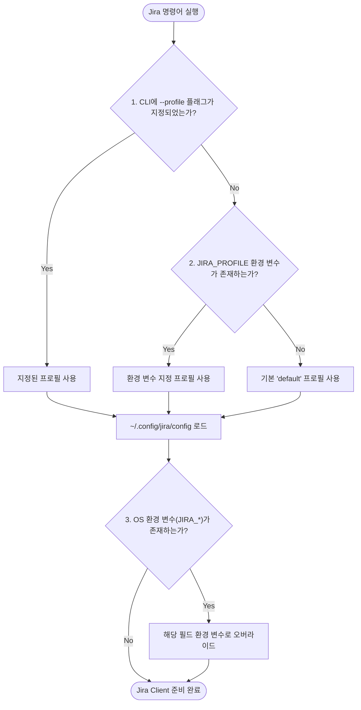

# ⚙️ 02. 설정 및 인증 아키텍처 (Configuration & Authentication)

이 문서는 Jira CLI의 INI 기반 멀티 프로필 설정 체계(`~/.config/jira/config`), 인증 토큰 보안 관리, 프로필 결정 우선순위 및 대화형 설정 마법사의 동작 방식을 다룹니다.

---

## 🎯 1. 프로필 결정 우선순위 (Profile Resolution Priority)

Jira CLI는 AWS CLI와 유사한 프로필 방식을 채택하여, 단일 설정 파일(`~/.config/jira/config`) 안에서 여러 Jira 계정/조직(예: 회사, 개인, 외주 등)을 손쉽게 전환할 수 있습니다.



### 상세 우선순위 목록

1. **활성 프로필 결정**:
   - 1순위: CLI 플래그 (`--profile <name>` 또는 `--profile=<name>`)
   - 2순위: 세션 환경 변수 (`JIRA_PROFILE`)
   - 3순위: 기본값 (`default`)
2. **설정 파일 탐색**:
   - 오직 `~/.config/jira/config` (권한 `0600`) 단일 경로에서 해당 프로필 섹션(`[<profile>]`)을 로드합니다.
   - 프로젝트 디렉토리 순회 탐색을 제거하여 저장소별 민감 정보 유출을 원천 방지합니다.
3. **환경 변수 개별 필드 오버라이드 (CI/CD Fallback)**:
   - `JIRA_INSTANCE_URL`, `JIRA_EMAIL`, `JIRA_API_TOKEN`, `JIRA_PROJECT_KEY` 환경 변수가 설정되어 있으면 해당 필드를 최종 오버라이드합니다.

---

## 📄 2. 설정 파일 스키마 (`~/.config/jira/config`)

설정 파일은 표준 INI 포맷입니다:

```ini
# Jira CLI Multi-Profile Configuration
# 위치: ~/.config/jira/config (권한: 0600)

[default]
instance_url = https://joincdream.atlassian.net
email = joinc.dream@gmail.com
api_token = ATATT3xFfGF0...YOUR_API_TOKEN...
project_key = KAN

[cloit]
instance_url = https://cloit-team.atlassian.net
email = user@cloit.com
api_token = ATATT3xFfGF0...ANOTHER_TOKEN...
project_key = CLOIT

[personal]
instance_url = https://personal.atlassian.net
email = me@gmail.com
api_token = ATATT3xFfGF0...PERSONAL_TOKEN...
project_key = MYPROJ
```

### 필드 명세

| 필드 | 필수 여부 | 설명 | 기본값 |
| :--- | :---: | :--- | :--- |
| `instance_url` | **필수** | Atlassian Jira Cloud 주소 (마지막 슬래시 `/` 자동 제거됨) | - |
| `email` | **필수** | Jira 계정 이메일 주소 | - |
| `api_token` | **필수** | Atlassian API 토큰 (Basic Auth 암호로 사용됨) | - |
| `project_key` | 선택 | 작업을 생성하거나 목록을 조회할 기본 프로젝트 키 | `KAN` |

---

## 🔒 3. 보안 정책 및 파일 권한

1. **엄격한 파일 권한 (0600)**:
   - `~/.config/jira/config` 파일은 오직 사용자 본인만 읽고 쓸 수 있도록 `0600` (`-rw-------`) 권한으로 기록됩니다.
2. **비밀번호/토큰 마스킹 (Secret Masking)**:
   - 대화형 마법사 실행 시 기존 설정에 API 토큰이 존재할 경우, 화면에 노출되지 않고 앞 4자리와 뒤 4자리만 마스킹(`ATAT...8x9F` 또는 `********`)하여 출력됩니다.
3. **중앙 집중형 관리 원칙 (Git 누출 차단)**:
   - 모든 인증 정보를 사용자 홈(`~/.config/jira/config`)에서만 관리하므로 코드 저장소에 토큰 파일이 포함되는 실수를 원천 방지합니다.

---

## 🧙 4. 대화형 설정 마법사 및 프로필 관리 (`jira configure`)

### 실행 방법

```bash
# 1. 기본 프로필(default) 대화형 설정
jira configure

# 2. 특정 프로필 생성 또는 수정
jira configure --profile cloit

# 3. 등록된 프로필 목록 및 현재 활성 프로필 확인
jira configure list
```

### 실행 예시 (`jira configure list`)

```text
설정 파일: /home/yundream/.config/jira/config

등록된 프로필 목록:
* [default] (https://joincdream.atlassian.net, joinc.dream@gmail.com) [현재 활성]
  [cloit] (https://cloit-team.atlassian.net, user@cloit.com)
  [personal] (https://personal.atlassian.net, me@gmail.com)
```
