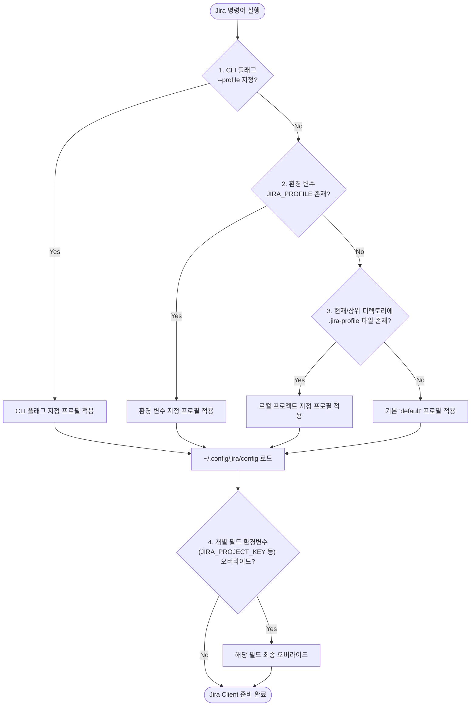

# ⚙️ 설정 및 프로필 아키텍처 (Configuration)

Jira CLI는 보안성과 멀티 테넌시(개인/회사/외주/프로젝트 분리)를 보장하기 위해 **중앙 집중형 INI 멀티 프로필**과 **디렉토리 기반 로컬 프로젝트 자동 탐색(`.jira-profile`)** 체계를 채택하고 있습니다.

---

## 🎯 1. 프로필 결정 우선순위 (Resolution Priority)

명령어가 실행될 때 활성 프로필(`Active Profile`)은 다음 4단계 계층을 통해 결정론적으로 결정됩니다:



### 상세 우선순위 명세
1. **1순위 (CLI 플래그)**: `--profile <name>` (예: `jira --profile cloit list`)
2. **2순위 (세션 환경 변수)**: `os.Getenv("JIRA_PROFILE")`
3. **3순위 (로컬 프로젝트 파일)**:
   - `pkg/client.go`의 `FindLocalProfile()` 함수가 현재 작업 디렉토리(`cwd`)부터 루트(`/`)까지 상위로 순회하며 `.jira-profile` 또는 `.jira/profile` 파일을 검색합니다.
   - 발견 시 첫 번째 유효 줄을 프로필 이름으로 채택합니다.
4. **4순위 (기본값)**: `"default"`

---

## 📄 2. 글로벌 설정 파일 스키마 (`~/.config/jira/config`)

설정 파일은 표준 INI 포맷이며, 토큰 보안을 위해 파일 생성 시 `0600` (소유자 읽기/쓰기 전용) 퍼미션으로 기록됩니다:

```ini
[default]
instance_url = https://joincdream.atlassian.net
email = joinc.dream@gmail.com
api_token = ATATT3xFfGF0...
project_key = KAN

[jira-cli]
instance_url = https://joincdream.atlassian.net
email = joinc.dream@gmail.com
api_token = ATATT3xFfGF0...
project_key = JC
```

### 필수 키 정의
- `instance_url`: Atlassian Cloud 인스턴스 전체 URL (끝의 슬래시 `/`는 자동 정규화됨)
- `email`: 계정 이메일 주소 (Basic Auth 사용자명)
- `api_token`: Atlassian API Token
- `project_key`: 기본 대상 Jira 프로젝트 코드 (예: `KAN`, `JC`). 미지정 시 `"KAN"`으로 기본 설정

---

## 📁 3. 로컬 프로젝트 파일 (`.jira-profile`)

각 프로젝트 소스 코드 루트에 `.jira-profile` 파일을 생성하고 프로필 이름 1줄을 작성해 두면, 프로젝트 폴더 내부 어디서든 해당 프로젝트 설정이 자동 적용됩니다:

```text
# /mnt/data/myjob/cloit/jira-cli/.jira-profile
jira-cli
```
- **장점**: 토큰은 안전하게 `~/.config/jira/config`에만 보관하고, 저장소에는 프로필 이름만 매핑하므로 보안과 편의성을 동시에 달성합니다.
