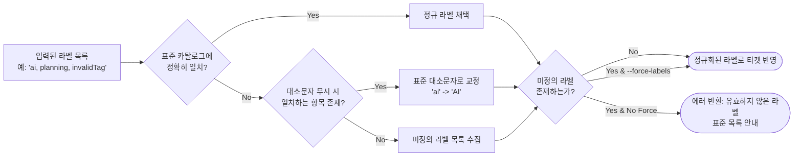

# 🏷️ 표준 라벨 카탈로그 및 유효성 검증 정책

Jira CLI는 다수의 개발자와 AI 에이전트가 협업할 때 라벨의 오타, 파편화 및 임의 생성을 방지하고 일관된 태그 품질을 유지하기 위해 **표준 라벨 카탈로그 검증 엔진**을 갖추고 있습니다.

---

## 🔍 1. 카탈로그 탐색 순서 (`LoadLabelCatalog`)

[pkg/labels.go](file:///mnt/data/myjob/cloit/jira-cli/pkg/labels.go)의 `LoadLabelCatalog()`는 현재 작업 디렉토리부터 상위 디렉토리로 순회하며 다음 후보 파일을 탐색합니다:

1. `현재경로/.agents/labels.json`
2. `현재경로/labels.json`
3. 상위 디렉토리로 재귀 탐색
4. 탐색 실패 시 내장 기본 카탈로그(`getDefaultCatalog()`, 3개 카테고리 14개 라벨)로 폴백

---

## 📂 2. 카탈로그 분류 체계 (Categories)

표준 카탈로그는 3대 축으로 구성됩니다:

1. **`project` (프로젝트 및 고객사)**:
   - `DIVE`, `AgentGo_Studio`, `Fursys`, `아트리안`, `FDE`
2. **`tech` (기술 및 도메인)**:
   - `AI`, `MCP`, `Cloud`, `Architecture`
3. **`activity` (업무 성격 및 산출물)**:
   - `Planning`, `Development`, `PoC`, `QA`, `Report`

---

## 🛡️ 3. 유효성 검사 및 대소문자 정규화 파이프라인

`jira create` 및 `jira edit` 실행 시 [pkg/labels.go](file:///mnt/data/myjob/cloit/jira-cli/pkg/labels.go)의 `ValidateAndNormalizeLabels()`가 자동으로 동작합니다:

### AI 에이전트 개발 시 주의사항
- AI 에이전트가 티켓을 생성할 때 임의의 라벨을 추측하여 입력하면 유효성 검증 실패로 명령이 중단될 수 있습니다.
- 따라서 신규 티켓 생성 전 항상 `jira labels`를 선행 호출하여 등록 가능한 표준 태그를 확인하거나, 비표준 태그가 반드시 필요할 때는 `--force-labels` 플래그를 함께 전달해야 합니다.
